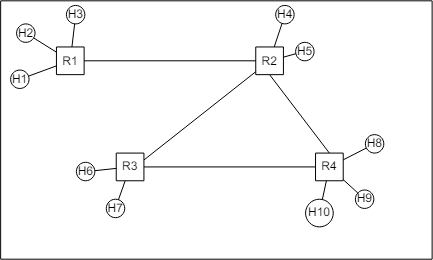

# Network Slicing Project#

## Short Introduction ##
This is the project #1 for Networking 2 Course held by Fabrizio Granelli. The objective is to implement by demonstration a network slicing strategy, which is able to adapt in case of an emergency situation within the Comnetsemu environment. The Comnetsemu source code can be found [here](https://git.comnets.net/public-repo/comnetsemu.git). 

*First you should follow all the respective instructions indicated in the [README.md](https://git.comnets.net/public-repo/comnetsemu/-/blob/master/README.md) file of the aforementioned link in order to build and install comnetsemu environment.*

In this repo is presented our implementation.


A multi-hop technology has been used for this emulation, i.e., we assume that there are X hosts (h1-hX) and Y routers (r1-rY) in the network:


Therefore, multiple scenario has been made, with different numbers of slices:


## Project Description: Emergency Network Slicing ##
(da modificare)

```text
The flow of the project is the following:
**Step 1:** The initial network is built where the (h1, h4) and (h2, h5) communications are enabled. The first link is shared for these communications leading to equal slices. 

**Step 2:** After K seconds the emergency scenario is activated and as a result the other hosts are also enabled. One additional slice is automatically created in the first link, whereas the initial two slices are dynamically reduced.

**Step 3:** After K seconds, the emergency situation is over and as a result the third slice is deleted, and everything is back to the *Step 1* situation (where only 2 slices exist).

*Note:* This process takes place in an automatic iterative manner. 
```

This folder contains the following files:
1. my_network.py: Python script to build a network with X hosts, Y routers and the respective links.

2. common_scenario.sh: Bash script that automatically build virtual queues in the routers for the non-emergency situation.

3. sos_scenario.sh: Bash script that automatically build a third virtual queue/slice in the routers for the emergency communication. 

4. emergency_slicing.py: Application that utilizes the aforementioned scripts in an automatic manner, in order to dynamically implement the network slicing strategy for the emergency communication.

### How to Run ###
You can simply run the emulation application with the following commands within the /home/vagrant/comnetsemu/app/net_slicing_project.

1. Enabling Ryu controller to load the application and to run in the background:
```bash
$ ryu-manager emergency_slicing.py &
```

2. Starting the network with Mininet: 
```bash
$ sudo python3 my_network.py
```

*Note 1:* Please stop the running Ryu controller before starting a new Ryu controller. For example, type `htop` in the terminal to show all running processes, press the key `F4` to look for the process *ryu-manager*, then press the key `F9` to stop the process, with the key `F10` to quite `htop`.

*Note 2:* When you want to stop the mininet, please delete the topology as follows:
```bash
mininet> exit
$ sudo mn -c
```

## How to Verify ##
There are four modes to verify the slices in the non-emergency and the emergency situation:

1. ping mode: verifying connecitvity, e.g.:
*Case 1: Non-Emergency Scenario* 
(da aggiungere)

*Case 2: Emergency Scenario* 
(da aggiungere)


2. iperf mode: verifying slices' bandwidth, e.g. (in both emergency/non-emergency situations):
*Case 1: Non-Emergency Scenario* 
(da aggiungere)


*Case 2: Emergency Scenario* 
(da aggiungere)


3. iperf mode: verifying slices' bandwidth, e.g. (in both emergency/non-emergency situations):
Start listening on the h4 as server and use h1 as client:
(da aggiungere)

Start listening on the h5 as server and use h2 as client:
(da aggiungere)

Start listening on the h6 as server and use h3 as client:
(da aggiungere)


4. client mode: verifying flows in each router and check the virtual queues/slices, e.g.:
(da aggiungere)

(da aggiungere)

## Implementation Details ##
In the project, a said number of slices is considered. Firstly, the tests has been done in a "Non Emergency" Scenario, in order to check the correct implementation of the connectivity between the host that needs to communicate. Therefore, each router will drop the packets that are not inside a predefined connection. 

The routes are defined manually inside the "network_slicing.py" file, in the following way:

```self.mac_to_port = {
            1: {"00:00:00:00:00:01": 2, "00:00:00:00:00:02": 3, "00:00:00:00:00:03": 4,
                "00:00:00:00:00:04": 1, "00:00:00:00:00:05": 1,
                "00:00:00:00:00:06": 1, "00:00:00:00:00:07": 1,
                "00:00:00:00:00:08": 1, "00:00:00:00:00:09": 1,"00:00:00:00:00:0a": 1
                },
            2: {"00:00:00:00:00:01": 1, "00:00:00:00:00:02": 1, "00:00:00:00:00:03": 1,
                "00:00:00:00:00:04": 3, "00:00:00:00:00:05": 4,
                "00:00:00:00:00:06": 2, "00:00:00:00:00:07": 2,
                "00:00:00:00:00:08": 2, "00:00:00:00:00:09": 2, "00:00:00:00:00:0a": 2
                },
            3: {"00:00:00:00:00:01": 1, "00:00:00:00:00:02": 1, "00:00:00:00:00:03": 1,
                "00:00:00:00:00:04": 1, "00:00:00:00:00:05": 1,
                "00:00:00:00:00:06": 3, "00:00:00:00:00:07": 4,
                "00:00:00:00:00:08": 2, "00:00:00:00:00:09": 2, "00:00:00:00:00:0a": 2
                },
            4: {"00:00:00:00:00:01": 1, "00:00:00:00:00:02": 1, "00:00:00:00:00:03": 1,
                "00:00:00:00:00:04": 1, "00:00:00:00:00:05": 1,
                "00:00:00:00:00:06": 1, "00:00:00:00:00:07": 1,
                "00:00:00:00:00:08": 2, "00:00:00:00:00:09": 3, "00:00:00:00:00:0a": 4},
        }
```
Taking for example the definition of the first router r1, is possible to break down the definition:
```
1: {"00:00:00:00:00:01": 2, "00:00:00:00:00:02": 3, "00:00:00:00:00:03": 4,
```
This line defines the first three hosts (h1-h3) that goes respectively on the port 2, 3 and 4. 
```
				"00:00:00:00:00:04": 1, "00:00:00:00:00:05": 1,
                "00:00:00:00:00:06": 1, "00:00:00:00:00:07": 1,
                "00:00:00:00:00:08": 1, "00:00:00:00:00:09": 1,"00:00:00:00:00:0a": 1
                }
```
The last lines defines all the other host configured inside the network to go on the port 1, which is the port that connects r1 and r2. 
With this kind of definition, is possible to map the destinations using the MAC. With this, the topology is defined and the hosts are linked as such:

```
Output of net
```

Having defined the destination, is crucial to define the mapping of the ports:
```
self.port_to_port = {
            1: {2: 1, 3: 1, 4: 1},
            # 2: {2: 1, 3: 1},
            # 3: {2: 1, 3: 1},
            4: {2: 1, 3: 1, 4: 1},
        }
```
Above can be seen an early stage of the port mapping. Is worth nothing that there are 4 routers and many hosts. Only two routers are properly defined, since the router r1 and r4 are the only two with only one connection to another router (r2 for r1, r3 for r4). Therefore, the port mapping is done only on those two, since r2 and r3 have multiple connections. 

Emergency Scenario
The emergency scenario can be thought as a scenario where two operators are involved, each for a specific slice.
When the emergency scenario is involed, each router defines two slices:
```
echo ' ---------------------------------------------- '
echo '*** Creating 2 slices of 5 Gbps ...'
echo 'Router1:'
sudo ovs-vsctl -- \
set port r1-eth1 qos=@newqos -- \
--id=@newqos create QoS type=linux-htb \
other-config:max-rate=1G \
queues:1=@1q \
queues:2=@2q -- \
--id=@1q create queue other-config:min-rate=1M other-config:max-rate=5G -- \
--id=@2q create queue other-config:min-rate=1M other-config:max-rate=5G

```
Each slice has a Minimum Rate of 1 MB and a Maximum Rate of 5GB. In the "2_operator_scenario.sh" can be seen how the slices are handled in order to make specific host communicate. For example, if h1 and h7 should communicate, the specific addresses should be defined, as such:
```
sudo ovs-ofctl add-flow r1 ip,priority=65500,nw_src=10.0.0.1,nw_dst=10.0.0.6,idle_timeout=0,actions=set_queue:1,normal
sudo ovs-ofctl add-flow r1 ip,priority=65500,nw_src=10.0.0.1,nw_dst=10.0.0.7,idle_timeout=0,actions=set_queue:2,normal 
```
Meanwhile, all the other connections to the other host should be blocked by dropping the packets. This should be done for each connection that is defined, which should make the system work. 

It is worth noticing that the "2_operator_scenario.sh" and the "3_operator_scenario.sh" overrides the configurations for the routers set by "all_scenario.sh" in terms of the speed of the connections. 
### Contributing

The Contributors of this project are the following:
- Michele Zucchelli: michele.zucchelli-1@studenti.unitn.it
- Samuele Trainotti: samuele.trainotti@studenti.unitn.it
- Denis Tairovski  : denis.tairovski@studenti.unitn.it


### Contact

Project main maintainers:

- Michele Zucchelli: michele.zucchelli-1@studenti.unitn.it
- Samuele Trainotti: samuele.trainotti@studenti.unitn.it
- Denis Tairovski  : denis.tairovski@studenti.unitn.it