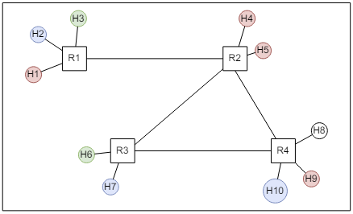

# Network Slicing Project #

## Short Introduction ##
This is the project #1 for Networking 2 Course held by Fabrizio Granelli. The objective is to implement by demonstration a network slicing strategy, which is able to adapt in case of an emergency situation within the Comnetsemu environment. The Comnetsemu source code can be found [here](https://git.comnets.net/public-repo/comnetsemu.git). 

*First you should follow all the respective instructions indicated in the [README.md](https://git.comnets.net/public-repo/comnetsemu/-/blob/master/README.md) file of the aforementioned link in order to build and install comnetsemu environment.*

In this repo is presented our implementation.

A multi-hop technology has been used for this emulation, i.e., we assume that there are 10 hosts (h1-h10) and 4 routers (r1-r4) in the network:


Therefore, multiple scenario has been made, with different numbers of slices:




## Project Description: Emergency Network Slicing ##
Initially, many host are connected with the respective routers, communicating with each other as shown in the Topology images. 
With the staring of the network slicing, the slicing is chosen randomly, alternating between 1, 2, 3 or the emergency scenario.
The total capacity of the link is set at 10Gbps, but can be set freely in each ".sh" file. 
The slices divide the link equally. 
With a 10% probability, a "Fault & Recovery" scenario can be activated which disables a link between r2 and r3 and activates the link between r2 and r4, in order to simulate a Recovery operation.

```text
The flow of the project is the following:
**Step 1:** The initial network is built where the (h1, h4) and (h2, h5) communications are enabled. The first link is shared for these communications leading to equal slices. 

**Step 2:** After K seconds the emergency scenario is activated and as a result the other hosts are also enabled. One additional slice is automatically created in the first link, whereas the initial two slices are dynamically reduced.

**Step 3:** After K seconds, the emergency situation is over and as a result the third slice is deleted, and everything is back to the *Step 1* situation (where only 2 slices exist).

*Note:* This process takes place in an automatic iterative manner. 
```
This folder contains the following files:
1. my_network.py: Python script to build a network with X hosts, Y routers and the respective links.

2. network_slicing.py: Python file that manages the addressing of the hosts, the slicing and the fault/recovery scenario.

3. X_operator_scenario.sh: Bash script for each Scenario that automatically build virtual queues in the routers for the non-emergency situation.

4. X_op_fault_and_recovery.sh: Bash script for each Scenario with the Fault Recovery operation.

5. enum_scenario.py: Just an Enumerator for the choice of the different scenario.

### How to Run ###
You can simply run the emulation application with the following commands within the /home/vagrant/comnetsemu/app/net_slicing_project.

1. Enabling Ryu controller to load the application and to run in the background:
```bash
$ ryu-manager network_slicing.py &
```

2. Starting the network with Mininet: 
```bash
$ sudo python3 my_network.py
```

*Note 1:* Please stop the running Ryu controller before starting a new Ryu controller. For example, type `htop` in the terminal to show all running processes, press the key `F4` to look for the process *ryu-manager*, then press the key `F9` to stop the process, with the key `F10` to quite `htop`.

*Note 2:* When you want to stop the mininet, please delete the topology as follows:
```bash
mininet> exit
$ sudo mn -c
```

## How to Verify ##
There are four modes to verify the slices in the non-emergency and the emergency situation:

1. ping mode: verifying connecitvity, e.g.:
*Case 1: Non-Emergency Scenario (3 Operators)* 
```
*** Ping: testing ping reachability
h1 -> X X h4 h5 X X X h9 X 
h2 -> X X X X X h7 X X h10 
h3 -> X X X X h6 X X X X 
h4 -> h1 X X h5 X X X h9 X 
h5 -> h1 X X h4 X X X h9 X 
h6 -> X X h3 X X X X X X 
h7 -> X h2 X X X X X X h10 
h8 -> X X X X X X X X X 
h9 -> h1 X X h4 h5 X X X X 
h10 -> X h2 X X X X h7 X X 
*** Results: 77% dropped (20/90 received)
```

*Case 2: Emergency Scenario* 
```
*** Ping: testing ping reachability
h1 -> h2 h3 h4 h5 h6 h7 h8 h9 h10 
h2 -> h1 h3 h4 h5 h6 h7 h8 h9 h10 
h3 -> h1 h2 h4 h5 h6 h7 h8 h9 h10 
h4 -> h1 h2 h3 h5 h6 h7 h8 h9 h10 
h5 -> h1 h2 h3 h4 h6 h7 h8 h9 h10 
h6 -> h1 h2 h3 h4 h5 h7 h8 h9 h10 
h7 -> h1 h2 h3 h4 h5 h6 h8 h9 h10 
h8 -> h1 h2 h3 h4 h5 h6 h7 h9 h10 
h9 -> h1 h2 h3 h4 h5 h6 h7 h8 h10 
h10 -> h1 h2 h3 h4 h5 h6 h7 h8 h9 
*** Results: 0% dropped (90/90 received)
```

2. iperf mode: verifying slices' bandwidth, e.g. (in both emergency/non-emergency situations):
*Case 1: Non-Emergency Scenario (2 Operators)*
```
*** Iperf: testing TCP bandwidth between h3 and h6 
*** Results: ['6.48 Gbits/sec', '6.51 Gbits/sec']
```
*Case 2: Emergency Scenario* 
```
*** Iperf: testing TCP bandwidth between h1 and h9 
*** Results: ['3.53 Gbits/sec', '3.54 Gbits/sec']
```
## Implementation Details ##
In the project, a said number of slices is considered. Firstly, the tests has been done in a "Non Emergency" Scenario, in order to check the correct implementation of the connectivity between the host that needs to communicate. Therefore, each router will drop the packets that are not inside a predefined connection. 

The routes are defined manually inside the "network_slicing.py" file, in the following way:

```
self.mac_to_port = {
            1: {"00:00:00:00:00:01": 2, "00:00:00:00:00:02": 3, "00:00:00:00:00:03": 4,
                "00:00:00:00:00:04": 1, "00:00:00:00:00:05": 1,
                "00:00:00:00:00:06": 1, "00:00:00:00:00:07": 1,
                "00:00:00:00:00:08": 1, "00:00:00:00:00:09": 1, "00:00:00:00:00:0a": 1
                },
            2: {"00:00:00:00:00:01": 1, "00:00:00:00:00:02": 1, "00:00:00:00:00:03": 1,
                "00:00:00:00:00:04": 4, "00:00:00:00:00:05": 5,
                "00:00:00:00:00:06": 2, "00:00:00:00:00:07": 2,
                "00:00:00:00:00:08": 2, "00:00:00:00:00:09": 2, "00:00:00:00:00:0a": 2
                },
            3: {"00:00:00:00:00:01": 1, "00:00:00:00:00:02": 1, "00:00:00:00:00:03": 1,
                "00:00:00:00:00:04": 1, "00:00:00:00:00:05": 1,
                "00:00:00:00:00:06": 3, "00:00:00:00:00:07": 4,
                "00:00:00:00:00:08": 2, "00:00:00:00:00:09": 2, "00:00:00:00:00:0a": 2
                },
            4: {"00:00:00:00:00:01": 1, "00:00:00:00:00:02": 1, "00:00:00:00:00:03": 1,
                "00:00:00:00:00:04": 1, "00:00:00:00:00:05": 1,
                "00:00:00:00:00:06": 1, "00:00:00:00:00:07": 1,
                "00:00:00:00:00:08": 3, "00:00:00:00:00:09": 4, "00:00:00:00:00:0a": 5},
        }
```
Taking for example the definition of the first router r1, is possible to break down the definition:
```
1: {"00:00:00:00:00:01": 2, "00:00:00:00:00:02": 3, "00:00:00:00:00:03": 4,
```
This line defines the first three hosts (h1-h3) that goes respectively on the port 2, 3 and 4. 
```
"00:00:00:00:00:04": 1, "00:00:00:00:00:05": 1,
"00:00:00:00:00:06": 1, "00:00:00:00:00:07": 1,
"00:00:00:00:00:08": 1, "00:00:00:00:00:09": 1,"00:00:00:00:00:0a": 1
}
```
The last lines defines all the other host configured inside the network to go on the port 1, which is the port that connects r1 and r2. 
With this kind of definition, is possible to map the destinations using the MAC. With this, the topology is defined and the hosts are linked as such:

```
h1 h1-eth0:r1-eth2
h2 h2-eth0:r1-eth3
h3 h3-eth0:r1-eth4
h4 h4-eth0:r2-eth4
h5 h5-eth0:r2-eth5
h6 h6-eth0:r3-eth3
h7 h7-eth0:r3-eth4
h8 h8-eth0:r4-eth3
h9 h9-eth0:r4-eth4
h10 h10-eth0:r4-eth5
r1 lo:  r1-eth1:r2-eth1 r1-eth2:h1-eth0 r1-eth3:h2-eth0 r1-eth4:h3-eth0
r2 lo:  r2-eth1:r1-eth1 r2-eth2:r3-eth1 r2-eth3:r4-eth2 r2-eth4:h4-eth0 r2-eth5:h5-eth0
r3 lo:  r3-eth1:r2-eth2 r3-eth2:r4-eth1 r3-eth3:h6-eth0 r3-eth4:h7-eth0
r4 lo:  r4-eth1:r3-eth2 r4-eth2:r2-eth3 r4-eth3:h8-eth0 r4-eth4:h9-eth0 r4-eth5:h10-eth0
c0
```
Having defined the destinations, is crucial to define the mapping of the switches:
```
self.end_switches = [1, 4]
```
Above can be seen an early stage of the switches mapping, which defines where the network starts and ends.
### Non-Emergency Scenario ###
The non-emergency scenario can be thought as a scenario where one, two or three operators are involved, each for a specific slice.
When the non-emergency scenario is involved, each router defines the said number of slices, in the case below, three:
```
# Creating 3 virtual queues in Router 1.
echo ' ---------------------------------------------- '
echo '*** Creating 3 slices of 5 Gbps ...'
echo 'Router1:'
sudo ovs-vsctl -- \
set port r1-eth1 qos=@newqos -- \
--id=@newqos create QoS type=linux-htb \
other-config:max-rate=10G \
queues:1=@1q \
queues:2=@2q \
queues:3=@3q -- \
--id=@1q create queue other-config:min-rate=1M other-config:max-rate=3G -- \
--id=@2q create queue other-config:min-rate=1M other-config:max-rate=3G -- \
--id=@3q create queue other-config:min-rate=1M other-config:max-rate=3G
```
Each slice has a Minimum Rate of 1 MB and a Maximum Rate of 3GB, in the 3 Operators Scenario. 
In the "3_operator_scenario.sh" can be seen how the slices are handled in order to make specific host communicate. 
For example, if h1 and h9 should communicate, the specific addresses should be defined, as such:
```
# (h1, h9) --> queue1
sudo ovs-ofctl add-flow r1 ip,priority=65500,nw_src=10.0.0.1,nw_dst=10.0.0.9,idle_timeout=0,actions=set_queue:1,normal
```
Meanwhile, all the other connections to the other host should be blocked by dropping the packets. 
This should be done for each connection that is defined, which should make the system work. 
```
# h1 - Source
sudo ovs-ofctl add-flow r1 ip,priority=65500,nw_src=10.0.0.1,nw_dst=10.0.0.2,idle_timeout=0,actions=drop
sudo ovs-ofctl add-flow r1 ip,priority=65500,nw_src=10.0.0.1,nw_dst=10.0.0.3,idle_timeout=0,actions=drop
sudo ovs-ofctl add-flow r1 ip,priority=65500,nw_src=10.0.0.1,nw_dst=10.0.0.6,idle_timeout=0,actions=drop
sudo ovs-ofctl add-flow r1 ip,priority=65500,nw_src=10.0.0.1,nw_dst=10.0.0.7,idle_timeout=0,actions=drop
sudo ovs-ofctl add-flow r1 ip,priority=65500,nw_src=10.0.0.1,nw_dst=10.0.0.10,idle_timeout=0,actions=drop
```
In the example above, the packets, sent to h1 from the hosts not in the same operator, are dropped.
Each bash files overrides each other.

### Emergency Scenario ###
The emergency scenario can be thought as a scenario where all are listening and all are speaking.
When the emergency scenario is involved, a single slice at Max Bandwidth (10Gbps) is defined, where all are communicating with each other.
```
# Creating 1 virtual queue in Router 1.
echo ' ---------------------------------------------- '
echo '*** Network Slicing: Creating 1 common slice ~ Emergency Scenario ...'
echo 'Router1:'
sudo ovs-vsctl -- \
set port r1-eth1 qos=@newqos -- \
--id=@newqos create QoS type=linux-htb \
other-config:max-rate=10G \
queues:1=@1q -- \
--id=@1q create queue other-config:min-rate=1M other-config:max-rate=10G
```
The slice has a Minimum Rate of 1 MB and a Maximum Rate of 10GB.
The "speaking" is done as follows:
```
#TX
sudo ovs-ofctl add-flow r1 ip,priority=65500,nw_src=10.0.0.1,idle_timeout=0,actions=flood
```
### Contributing

The Contributors of this project are the following:
- Michele Zucchelli: michele.zucchelli-1@studenti.unitn.it
- Samuele Trainotti: samuele.trainotti@studenti.unitn.it
- Denis Tairovski  : denis.tairovski@studenti.unitn.it


### Contact

Project main maintainers:

- Michele Zucchelli: michele.zucchelli-1@studenti.unitn.it
- Samuele Trainotti: samuele.trainotti@studenti.unitn.it
- Denis Tairovski  : denis.tairovski@studenti.unitn.it